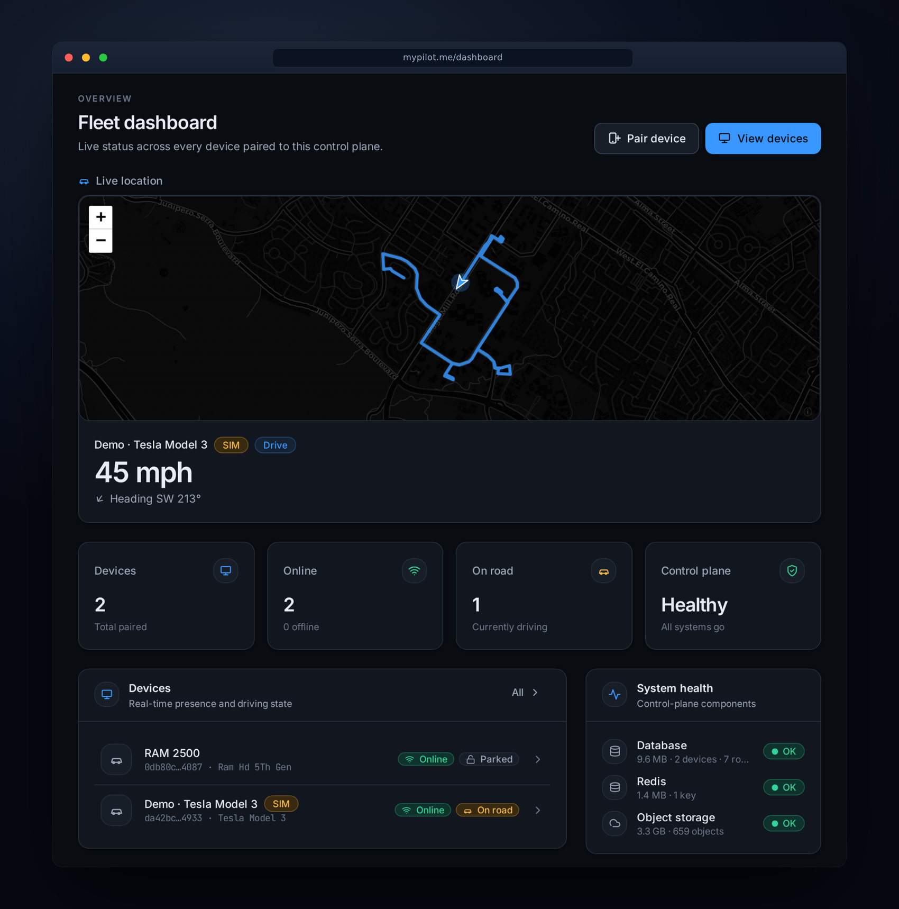

# MyPilot

**MyPilot** is a fully self-hosted control plane for a [SunnyPilot](https://github.com/sunnypilot/sunnypilot)/[openpilot](https://github.com/commaai/openpilot)
fork. It lets you run your own driving-stack control panel — device management, logs, routes,
settings, model management, backups, and device pairing — **without** relying on SunnyLink,
comma connect, or any third-party hosted backend.

<p align="center">
  
  <br>
  <em>The fleet dashboard — live location (speed, heading, GPS trail) while a device is driving, alongside fleet stats, device presence, system health, and recent activity.</em>
</p>

> **You own the device, the data, the logs, the routes, the models, and the control plane.**
> No required third-party cloud. No required SaaS account. Your device keeps driving normally
> even if the MyPilot Stack is offline.

## ⚠️ Alpha — extremely untested. Use at your own risk.

> **This is alpha software that runs on a moving car.** It has only ever been tested on a **single
> comma 4**, and not extensively. It has **not** been validated on any other hardware, vehicle, or
> at scale. Expect bugs.
>
> **If you run this on a car, you are fully responsible for the vehicle at all times:**
> - **Keep your hands on the wheel and stay attentive every second** the car is in motion.
> - **Be ready to take over instantly** — assume the system can fail or behave unexpectedly without
>   warning.
> - This is **driver-assistance, not self-driving.** You are the driver.
>
> MyPilot does not modify or weaken openpilot/SunnyPilot safety systems (see [Safety](#safety)), but
> that is **no guarantee of safe operation.** There is **no warranty.** Do not use it in any way that
> endangers you, your passengers, or anyone else on the road. If you are not comfortable accepting
> these risks, **do not install it on a vehicle.**

## Project components

| Name | What it is |
| --- | --- |
| **MyPilot (device build)** | The installable comma-4 build: an upstream base (sunnypilot/openpilot/frogpilot) + the MyPilot overlay, generated by [`mypilot-mici`](mypilot-mici/) |
| **MyPilot Stack** | The self-hosted backend (API + realtime + ingest + worker + db + redis + object storage) |
| **MyPilot Web** | The browser control panel (SvelteKit) |
| **MyPilot Agent** | The device-side agent that pairs and reports to the Stack |
| **MyPilot Device** | A paired comma device |
| **MyPilot Builder** | Optional build/update service (later milestone) |

## Repository model — two repos, one source of truth

MyPilot is authored in **one monorepo** and *delivered* to devices through a second repo that only
exists to satisfy the comma installer.

- **`castanley/mypilot`** (this repo, public) — the **monorepo / source of truth**: `mypilot-web`,
  `mypilot-stack`, `mypilot-agent`, `mypilot-protocol`, the `mypilot-mici` device build recipe,
  `docs`, and `deploy`. You work here.
- **`castanley/openpilot`** — the **device delivery target**. The comma installer clones
  `github.com/<owner>/openpilot@<branch>`, so the repo **must** be named `openpilot`. Its branches
  are **auto-generated** from this monorepo — never hand-edited. The comma 4 installs a branch of it.

```
this monorepo ──mypilot-mici/assemble──▶ castanley/openpilot @ <branch> ──installer.comma.ai──▶ comma 4
```

The device build is assembled fresh from `mypilot-agent` + `mypilot-protocol` every run, so the
agent never lives in two places. "Which upstream" is just a row in
[`mypilot-mici/recipe.json`](mypilot-mici/recipe.json) — MyPilot builds on **sunnypilot**
(validated), **openpilot**, and **frogpilot** bases. The brand-forward folders here never appear on
the device branch; they're for humans.

| Dir | Component |
| --- | --- |
| `mypilot-web/` | MyPilot Web (SvelteKit panel) |
| `mypilot-stack/` | MyPilot Stack (FastAPI `api/` + future services) |
| `mypilot-agent/` | MyPilot Agent (device sidecar; the overlay source of truth) |
| `mypilot-protocol/` | shared Ed25519 signing + message schemas |
| `mypilot-mici/` | device build recipe (assembles an upstream base + the agent overlay) |
| `deploy/`, `docs/`, `scripts/` | deployment, docs (rendered live at `/docs`), helpers |

## Status

This repository is the full self-hosted control plane **plus a real, installable comma-4 build**.
No driving/vehicle control code is modified — the MyPilot agent is a non-critical sidecar, and a
**thorough simulated device** drives the whole stack so every flow is exercised without hardware
(pair → settings → models → software → backups → routes/logs, all green against the live stack).
The **same agent** runs on a physical comma 4 via the [`mypilot-mici`](mypilot-mici/) build recipe.

What works today:

- Podman-first container stack (Postgres, Redis, MinIO, API, Web, Caddy)
- First-admin setup + login (Argon2id, server-side sessions, CSRF)
- Device pairing (Ed25519 keys, short-lived one-time codes), live presence over WebSockets
- Device dashboard + detail (status: storage/thermal/panda/GPS, onroad/offroad)
- **Settings** (M3): typed catalog, async change with offroad/danger/capability gating, audit,
  reset-to-default
- **Routes & logs** (M4): signed device ingest → object storage, list/detail, real-byte
  download, delete, retention sweep
- **Models** (M5): catalog with real artifacts + sha256; offroad-only switch the device
  **checksum-verifies** before activating; rollback
- **Backups** (M6): settings snapshot → JSON, diff vs current, offroad-only restore, JSON import
  for device-to-device migration
- **Software** (M7): release channels, offroad-only update + rollback (device reports the new
  version)
- Audit log for every remote action; everything driving-affecting is offroad-gated + confirmed
- **Real comma-4 build**: the [`mypilot-mici`](mypilot-mici/) recipe assembles an upstream base
  (sunnypilot / openpilot / frogpilot) + the MyPilot agent into installable branches; on-device the
  agent does **on-screen pairing** (no SSH), settings, **model switch** (device verifies sha256),
  and **software update** — all offroad-gated. See [docs/comma4-install.md](docs/comma4-install.md).

## Quick start (Podman)

```bash
git clone <your-fork-url> mypilot && cd mypilot
./scripts/install.sh
```

The installer checks for Podman, generates secrets into a git-ignored `.env`, starts the
stack, and prints the local URL. Then:

1. Open the printed URL (default <http://localhost>).
2. Create the **first admin** account on the setup screen.
3. Pair the **simulated device**:
   ```bash
   ./scripts/dev-sim-device.sh
   ```
   It prints a pairing code. Enter it in **Web → Devices → Add device**.
4. The device appears online with live status. Open it to manage **Settings, Models, Software,
   Backups**, and view **Routes/Logs** — all backed by the simulated device.

Docker is also supported (`docker compose ...`), but **Podman is first class**.

## Everyday tasks

- **Change settings** — Device → Settings. Driving-related settings only apply **offroad**; each
  change is audited and reconciled live.
- **Switch driving model** — Device → Models. Offroad-only; the device verifies the model
  **checksum** before activating. Roll back with one click.
- **Update software** — Device → Software (or the **Software** hub). Pick a release on a channel;
  offroad-only install; roll back to the previous version.
- **Back up & restore** — Device → Backups: snapshot settings to JSON, **diff** against current,
  restore (offroad), or download the JSON. The **Backups** hub imports a JSON to migrate settings
  between devices.
- **Routes & logs** — the **Routes**/**Logs** pages list what the device uploaded; download the
  real bytes or delete them. Set a retention policy to auto-prune.

## Pairing a real comma 4

A real, installable build exists. The default channel is **`castanley/mypilot-mici`** (SunnyPilot
`release-mici` base + the MyPilot agent, no driving/safety changes); `-staging` tracks staging.
Openpilot and frogpilot bases are also published (`mypilot-mici-op`, `mypilot-mici-frog`) but are
**experimental** — generated and structurally valid, not yet validated on a physical comma 4. On
the comma 4, install via **Settings → Software → Custom Software → `castanley/mypilot-mici`**, then
pair the printed code at `https://mypilot.me`. Full steps, configuration, debugging, and the
real-vs-staged breakdown are in **[docs/comma4-install.md](docs/comma4-install.md)**.

The on-device agent uses the comma's own libraries (aiohttp + pycryptodome), reads state from
openpilot **Params**/cereal, and performs **offroad-only** management. It's a non-critical sidecar
— if it crashes or `mypilot.me` is unreachable, **driving is unaffected**.

For local development without hardware, the simulated device backend is selected by default; the
real backend is `--real` (or `MYPILOT_AGENT_REAL=1`).

## Documentation

- [docs/architecture.md](docs/architecture.md) — services, data flow, realtime model
- [docs/install.md](docs/install.md) — install, deployment targets, LAN/Tailscale/TLS
- [docs/security.md](docs/security.md) — auth, device auth, audit, safety guardrails
- [docs/privacy.md](docs/privacy.md) — what is stored, retention, local-first defaults
- [docs/device-registration.md](docs/device-registration.md) — the pairing handshake
- [docs/development.md](docs/development.md) — local dev, tests, code generation
- [docs/self-hosting.md](docs/self-hosting.md) — **start here** to run your own instance (quickstart)
- [docs/forking.md](docs/forking.md) — fork it: set your own Stack URL + install source (no hard-coding)
- [docs/go-live.md](docs/go-live.md) — production checklist for a public Stack (auth, exposure, backups, sync)
- [docs/comma4-install.md](docs/comma4-install.md) — install the MyPilot build on a comma 4 + pair it
- [docs/update-channels.md](docs/update-channels.md) — software channels, releases, install URLs (M7/M10)

## Known limitations

- The **openpilot** and **frogpilot** device bases are published but **not yet validated on a
  physical comma 4** (sunnypilot is the validated default); frogpilot's publish is currently blocked
  by its LFS / divergent history (see [mypilot-mici/README.md](mypilot-mici/README.md)).
- The owner signs in as the admin; passkeys/OIDC are future options.
- Routes are listed/downloaded but not yet replayed (no map/segment/CAN graphs).
- The Developer and Security **pages** are planned; their server foundations (params, sessions,
  device keys, audit) already exist.

## Safety

> **Read the alpha warning at the top of this README first.** This is alpha software, tested only on
> a single comma 4 and not extensively. Keep your hands on the wheel, stay attentive at all times, and
> be ready to take over instantly. It is driver-assistance, not self-driving, and there is no
> warranty — you operate the vehicle at your own risk.

MyPilot **does not** modify, weaken, or bypass any openpilot/SunnyPilot safety system. Anything
that could affect active driving requires **offroad** mode, explicit confirmation, and is
audited. Remote shell and SSH-key changes are not enabled by default. See
[docs/security.md](docs/security.md).

This is a design boundary, **not** a guarantee that the overall system is safe to drive on — it is
unvalidated alpha. The control plane does not make MyPilot safer than the underlying openpilot/
SunnyPilot stack; treat the whole thing as experimental.

## License

See `LICENSE` (to be added). MyPilot builds its own self-hosted backend and does not copy
private SunnyLink backend code or depend on comma's hosted services.
